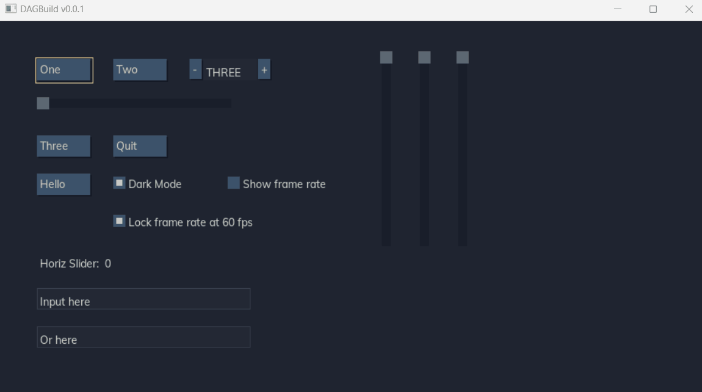

# DAGBuild GUI

This started as an experimental build tool but has evolved into a GUI framework
for building immediate-mode GUIs. It's very much a science project but might be
a fun inspiration or starting point for someone else. This uses the excellent 
SDLAda project for cross-platform windowing, pixel primitives and input handling.

It uses Ada's rich type system to do things like bound scrollbars, etc. by their
underlying type range, and using enums for spinner values without having to
explicitly specify the spinner inputs.

## TODO
* Clipboard Operations
* Viewport/Scrollbars
* Accessibility (TTS)
* Combo Boxes
* Menus
* Nodes
* Layout
* Widget groups
